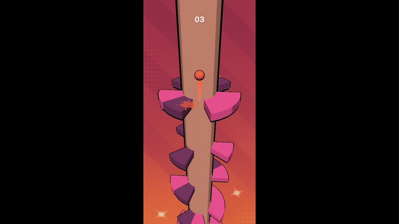

# 🎮 Helix Jump Clone (Unity)

A simple **Helix Jump** style game built with Unity and C#.  
The player controls a bouncing ball that descends through a helix tower while avoiding obstacles.

---

## 🎮 Play on Itch.io

---

## 📸 Gameplay
  

---

## 🚀 Features
- Smooth ball physics and bounce mechanics  
- Rotating helix tower  
- Score system  
- Simple UI (Start, Game Over, Restart)  

---

## 🎮 How to Play
- Rotate the tower left/right to guide the ball down.  
- Avoid landing on the **colored obstacles**.  
- Reach the bottom to finish the game.  

**Controls:**    
- **Mobile**: Swipe left/right on screen  

---

## 🛠️ Tech Stack
- **Engine:** Unity 6  
- **Language:** C#  
- **Platform:** Android  

---

## 📦 Setup & Installation
- On Android, you may see a warning since this game is not from the Play Store.
- The APK is safe to install as it is signed with a release keystore.
